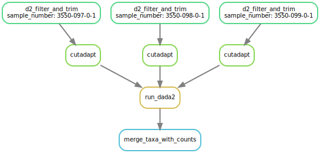

Pollen ITS wrapper
==================

Preconfigured pipeline for converting the fastq output from pollen ITS
sequencing to a CSV of taxon counts.

This pipeline:

1. Runs the recommended filter and trimming steps with cutadapt
2. Runs ``dada2`` on the filtered reads
3. Combines the resulting counts table with supplied taxonomic
   information

Install
-------

Using ``singularity``
~~~~~~~~~~~~~~~~~~~~~

|https://www.singularity-hub.org/static/img/hosted-singularity–hub-%23e32929.svg|

Use the singularity container hosted on `Singularity
hub <https://singularity-hub.org/collections/5055>`__. The container
provides:

::

   cutadapt
   dada2
   data.table

Using ``pip``
~~~~~~~~~~~~~

If you have the dependencies installed, you can install the pipeline
with ``pip3``:

.. code:: bash

   python3 -m pip install \
       git+git://github.com/tomharrop/pollen-its-wrapper.git

Running
-------

-  With singularity:
   ``singularity exec path/to/pollen-its-wrapper.sif pollen_its_wrapper``
-  With ``pip`` install: ``pollen_its_wrapper``

Usage
-----

::

   pollen_its_wrapper [-h] [-n] [--threads int]
                             [--restart_times RESTART_TIMES] --database DATABASE
                             [--forward_primer ITS_F] [--reverse_primer ITS_R]
                             --samples_csv SAMPLES_CSV --outdir OUTDIR

   optional arguments:
     -h, --help            show this help message and exit
     -n                    Dry run
     --threads int         Number of threads. Default: 4
     --restart_times RESTART_TIMES
                           number of times to restart failing jobs (default 0)
     --database DATABASE   Reference fasta file (see README)
     --forward_primer ITS_F
                           Forward primer EXCLUDING barcode
     --reverse_primer ITS_R
                           Reverse primer EXCLUDING barcode
     --samples_csv SAMPLES_CSV
                           Sample csv (see README)
     --outdir OUTDIR       Output directory

-  The ``--database`` should be a FASTA file with sequence identifiers
   giving the taxonomic levels, e.g.

::

   >k_Viridiplantae;p_Streptophyta;c_;o_Solanales;f_Solanaceae;g_Nicotiana;s_Nicotiana.occidentalis
   GTGAACCTGCGGAAGGATCATTGTCGAAACCTGCAAGGCAGAACGACCCGCGAACTTGTT
   TAAAAACTGGGGAGCAGTGCGGCCGGGATGCTTCGGCCTCCGTCCGTGCGGCTTCCTCCT
   ...

-  ``--samples_csv`` should have columns with the sample name and the
   path to the r1 and r2 files. Only one row per sample is allowed.

::

   sample,r1_path,r2_path
   3550-097-0-1,data/3550-097-0-1_S1_L001_R1_001.fastq.gz,data/3550-097-0-1_L001-ds.b11339737a254dd9aac0f509ebde3437/3550-097-0-1_S1_L001_R2_001.fastq.gz
   3550-098-0-1,data/3550-098-0-1_S2_L001_R1_001.fastq.gz,data/3550-098-0-1_L001-ds.81403738ef3046ee8243ab63901d0070/3550-098-0-1_S2_L001_R2_001.fastq.gz
   3550-099-0-1,data/3550-099-0-1_S3_L001_R1_001.fastq.gz,data/3550-099-0-1_L001-ds.d93a6aeeb0364f6791eb7e4322d4e89d/3550-099-0-1_S3_L001_R2_001.fastq.gz

Graph
-----

|image1|

.. |https://www.singularity-hub.org/static/img/hosted-singularity–hub-%23e32929.svg| image:: https://www.singularity-hub.org/static/img/hosted-singularity--hub-%23e32929.svg
   :target: https://singularity-hub.org/collections/5055

